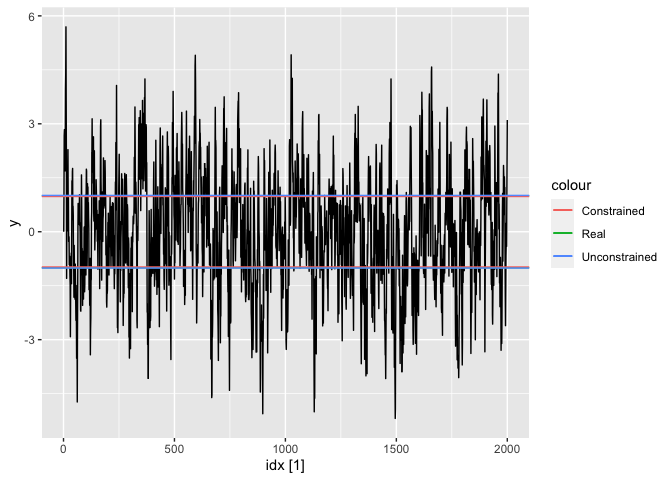

<!-- README.md is generated from README.Rmd. Please edit that file -->

# fable.thrreg

<!-- badges: start -->
<!-- badges: end -->

The goal of fable.thrreg is to extend `fable` package to fit threshold
regression.

## Installation

You can install the development version of fable.thrreg like so:

``` r
remotes::install_github("FinYang/fable.thrreg")
```

## Example

This is a basic example which shows you how to fit a threshold
regression.

``` r
library(fable.thrreg)

library(tidyverse) 
library(fable)
library(tsibble)
```

### Simulation

We simulate from the following two regimes threshold model:

$$
y_{t} = \delta_0y_{t-1} + \delta_1 y_{t-1} I(|y_{t-1}| >\gamma_1) + \epsilon_t, \ \epsilon_t \sim N(0, 1)
$$ where $\delta_0 = 1$, $\delta_1 = -0.2$ and $\gamma_1 = 1$.

``` r
# Simulate a time series
threshold_process <- function(lag1, error){
  if(abs(lag1) > 1) {
    # Above threshold of 1
    # Mean reverting 
    # AR1 process with coeffcient 0.8
    lag1 * 0.8 + error
  } else {
    # Below threshold of 1
    # a unit root process
    lag1 + error
  }
}
set.seed(2222)
time_span <- 2000
y <- numeric(time_span)
errors <- rnorm(time_span)
for(i in 2:time_span) y[[i]] <- threshold_process(y[[i-1]], errors[[i]])

# Convert to tsibble
df <- tsibble(y = y, idx = seq_along(y), index = idx)
```

We then fit the model using the package to estimate $$
y_{t} = y_{t-1} +\hat{\delta}_1 y_{t-1} I(|y_{t-1}| >\hat{\gamma}_1) + \epsilon_t,
$$ here we constraint the coefficient of $y_{t-1}$ to be 1.

``` r
# Fit the threshold regression
fit <- df %>% 
  model(thrreg = THRREG(y ~ one(lag(y)) + lag(y)*ind(abs(lag(y)) >= gamma(1))))
# Getting estimates
est <- tidy(fit)
est
#> # A tibble: 3 × 6
#>   .model term                                estimate std.e…¹ statis…²   p.value
#>   <chr>  <chr>                                  <dbl>   <dbl>    <dbl>     <dbl>
#> 1 thrreg (Intercept)                         -3.86e-4  0.0227  -0.0170  9.86e- 1
#> 2 thrreg I(lag(y) * (abs(lag(y)) >= 0.97949… -2.20e-1  0.0141 -15.6     8.02e-52
#> 3 thrreg .gamma_1                             9.79e-1 NA       NA      NA       
#> # … with abbreviated variable names ¹​std.error, ²​statistic

# Estimated threshold value
.gamma_1_constrained <- est$estimate[est$term == ".gamma_1"]
```

We find $\hat{\delta}_1 = -0.22$ and $\hat{\gamma}_1 = 0.979$.

We can also try fitting the unconstrained model $$
y_{t} = \hat{\delta}_0y_{t-1} +\hat{\delta}_1 y_{t-1} I(|y_{t-1}| >\hat{\gamma}_1) + \epsilon_t.
$$

``` r
# Fit the threshold regression
fit <- df %>% 
  model(thrreg = THRREG(y ~ lag(y) + lag(y)*ind(abs(lag(y)) >= gamma(1))))
# Getting estimates
est <- tidy(fit)
est
#> # A tibble: 4 × 6
#>   .model term                                estimate std.e…¹ statis…²   p.value
#>   <chr>  <chr>                                  <dbl>   <dbl>    <dbl>     <dbl>
#> 1 thrreg (Intercept)                          1.39e-4  0.0227  0.00612  9.95e- 1
#> 2 thrreg I(lag(y) * (abs(lag(y)) >= 1.00949… -1.86e-1  0.0600 -3.10     1.98e- 3
#> 3 thrreg lag(y)                               9.66e-1  0.0583 16.6      7.25e-58
#> 4 thrreg .gamma_1                             1.01e+0 NA      NA       NA       
#> # … with abbreviated variable names ¹​std.error, ²​statistic

# Estimated threshold value
.gamma_1_unconstrained <- est$estimate[est$term == ".gamma_1"]
```

We find $\hat{\delta}_0 = 0.966$, $\hat{\delta}_1 = -0.186$ and
$\hat{\gamma}_1 = 1.01$.

``` r
# Plot
autoplot(df, y) +
  ggplot2::geom_hline(mapping = aes(yintercept = -1, colour = "Real")) +
  ggplot2::geom_hline(mapping = aes(yintercept = 1, colour = "Real")) +
  ggplot2::geom_hline(mapping = aes(yintercept = -.gamma_1_constrained, colour = "Constrained")) + 
  ggplot2::geom_hline(mapping = aes(yintercept =  .gamma_1_constrained, colour = "Constrained")) + 
  ggplot2::geom_hline(mapping = aes(yintercept =-.gamma_1_unconstrained, colour = "Unconstrained")) +
  ggplot2::geom_hline(mapping = aes(yintercept =.gamma_1_unconstrained, colour = "Unconstrained"))
```


